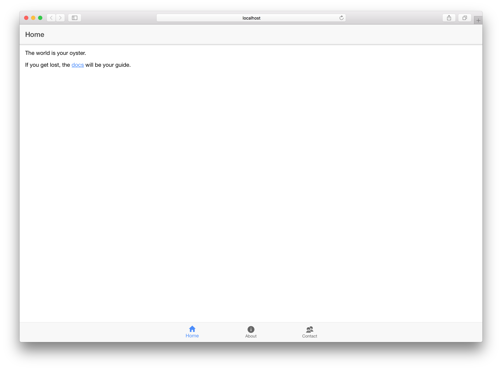

Before you can follow any of the Ionic tutorials on this website, you need to install Ionic onto you machine. Below are instructions that can help you through the process of installing Ionic on which ever platform you are running. If you experience any problems with the instructions below, kindly leave a comment and I’ll do my best to help you out. If you have Ionic installed (Ionic4), move right along to the first tutorial of [building a Social Task Manager](https://www.ionicfire.com/creating-ionic-app-part-1-basic-task-manager/).

## Installing NPM

## Mac

NPM is a package management for Node.JS. You can find a lot of free packages on [http://www.npmjs.com](https://www.npmjs.com/) to use on your Node.JS applications. NPM can also be used to install global command line utilities, and one of them happens to be Ionic. Before installing Ionic, you need to make sure you have NPM installed on your system. Below are instructions for installing NPM for Mac, Linux & Windows. If you have NPM installed, then you can move right along to [installing Ionic](https://www.ionicfire.com/installing-ionic/#installing-ionic).

Although you can download Node.JS and NPM from [https://nodejs.org,](https://nodejs.org/en/) I don’t recommend it. Biggest reason being you’ll be required to run your NPM commands with a sudo to get administrator rights. This can cause havoc if something goes wrong while running a Node.JS package. Easiest way to avoid the issues above is to install Homebrew. Copy and run the line below on your Mac’s terminal

```shell
/usr/bin/ruby -e "$(curl -fsSL https://raw.githubusercontent.com/Homebrew/install/master/install)"
```

Now that brew is installed, it’s time to install NPM. On your terminal app, run this

```
brew install node
```

That’s it, NPM is installed. To see if it’s installed, type the line below on Terminal. You should see the version number print. `node -v`

## Ubuntu

Before installing NPM, on Linux you need to have Ruby 1.8.6 or newer and GCC 4.2 or newer installed. We also need to have Homebrew installed as we will install NPM from Homebrew. Homebrew used to be only on Mac, but now it is also on Linux. I chose Homebrew to install NPM because it makes everything a lot easier and doesn’t require “sudo” to run NPM commands.

Copy and run the following in your terminal

```shell
sudo apt-get install build-essential curl git m4 ruby texinfo libbz2-dev libcurl4-openssl-dev libexpat-dev libncurses-dev zlib1g-dev
```

Next we need to install homebrew

```shell
ruby -e "$(curl -fsSL https://raw.githubusercontent.com/Homebrew/linuxbrew/go/install)"
```

Once Linuxbrew is installed, run brew update in your terminal to update to get the latest packages and then copy the following 3 lines into your .bashrc file:

```shell
test -d ~/.linuxbrew && PATH="$HOME/.linuxbrew/bin:$HOME/.linuxbrew/sbin:$PATH"
test -d /home/linuxbrew/.linuxbrew && PATH="/home/linuxbrew/.linuxbrew/bin:/home/linuxbrew/.linuxbrew/sbin:$PATH"
test -r ~/.bash_profile && echo "export PATH='$(brew --prefix)/bin:$(brew --prefix)/sbin'":'"$PATH"' >>~/.bash_profile
echo "export PATH='$(brew --prefix)/bin:$(brew --prefix)/sbin'":'"$PATH"' >>~/.profile
```

Lastly run the command below to install NPM

```shell
brew install node
```

To make sure everything worked out well, run npm -v in the terminal and you should see the version number printed.

## Windows

This is the easiest to install out of all 3 platforms.

1. First download the installer from [https://nodejs.org](https://nodejs.org/) and then run it.
2. Follow the installation instructions
3. Restart your computer
4. Run “npm -v” on your command line to test if NPM is working, if it’s working then it will print out the version number

## Installing Ionic

Now that we have NPM installed, we are able to install the Ionic CLI. The Ionic CLI (Client Line Interface) is the tool we’ll be using to start new Ionic projects, create pages, compiling our apps and many more features. It’s basically our lifeline in our Ionic journey. The CLI is one of the packages you find on NPM, so to install it type:

```shell
npm install -g ionic cordova
```

The command above will install Ionic 4 & Cordova. Cordova is what wraps our Ionic HTML5, CSS & JavaScript code into a native app. It also gives us access to the phone’s native features like the camera, location and many more. Test if Ionic is installed by typing ionic -v and it should print out the Ionic version.

## Create your first app

Run the command below to create your first Ionic4 app.

```shell
ionic start FirstApp tabs --type=angular
```

This command tells ionic to create an app named “HelloWorld” using the “tabs” layout as the starting layout (you can choose among blank, tabs and slidemenu). The command above also tells ionic to use angular as our framework of choice. Once that’s done run the following command:

```shell
ionic serve
```



If all goes well, a new browser window will be opened with your app running. Congratulations, you have just created your first Ionic4 app. Let’s now build an interactive [Lotto Number Generator](https://www.ionicfire.com/text-buttons-and-images/) in the next tutorial.